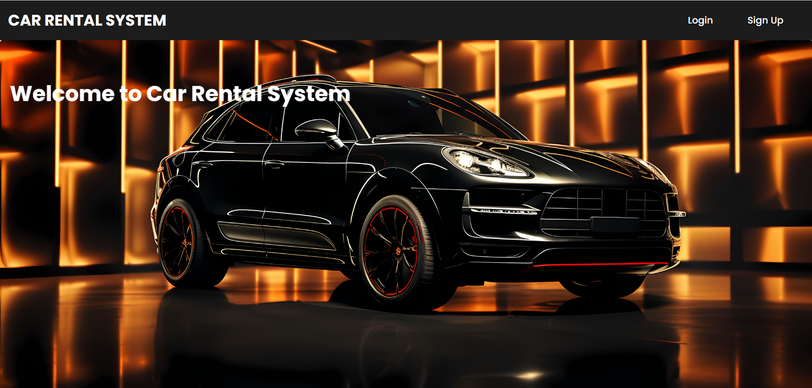
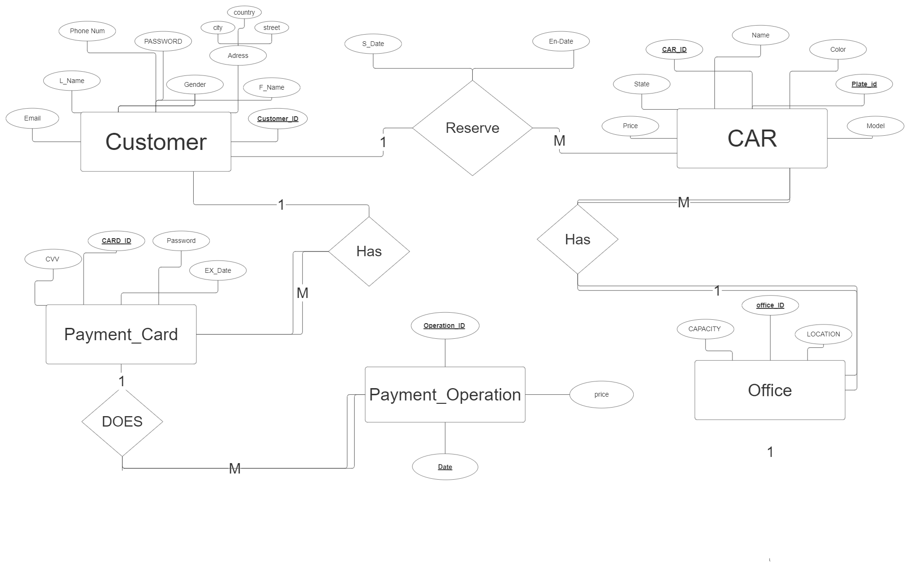

# Car Rental System

## Table of Contents

1. [Summary](#summary)
2. [Overview](#overview)
3. [Implemented Features](#implemented-features)
4. [Technical Architecture](#technical-architecture)
5. [ERD](#erd)
6. [Challenges Faced](#challenges-faced)
7. [Feature Enhancements](#feature-enhancements)
8. [Conclusion](#conclusion)

---

## Summary

The Car Rental System is a database project designed to streamline the process of reserving and returning cars for both customers and administrators. It offers a user-friendly interface for customers to reserve cars, return rented cars, view their reservation history, and browse available cars with images and status. Administrators have access to a control panel for managing and adding office and car details, availability, and customer reservations within a specific period.

---

## Overview

**1. Project Description:**  
The Car Rental System aims to automate and simplify the car rental process. Customers can reserve cars, view available cars, and return rented cars. Administrators can add & manage car details, toggle availability, and oversee customer reservations.

**2. Objectives:**

- Provide customers with an easy-to-use platform for reserving and returning cars.
- Enable administrators to manage car details, availability, and customer reservations efficiently.
- Ensure data integrity and security through a well-designed database schema.

---

## Implemented Features

### 1. Customer Module:

- **Car Reservation:**
  - Users can select an office location.
  - Dynamic loading of available cars based on the selected office.
  - Selection of payment card and entry of reservation dates.
  - Real-time price calculation based on the selected car, start date, and end date.
  - Validation for required fields and proper error handling.
- **Car Return:**
  - Customers can view their rented cars and select the car they want to return.
  - Display of penalties for late returns.
  - Real-time penalty calculation based on the selected return date.
- **Available Cars:**
  - Displays currently available and unavailable cars.
  - Customers can search for specific cars.

### 2. Administrator Module:

- **Car Management:**
  - Display a table with car details (ID, Plate ID, Make, Model, etc.).
  - Toggle car availability with real-time updates.
  - Deletion of cars with proper confirmation.
- **Car Registration:**
  - Register a car with proper values and its image file.
- **Office Registration:**
  - Register an Office with proper values.
- **Reservations:**
  - Display a table with all reservations and the details of a specific period from a specific customer and car.

---

## Technical Architecture

**1. System Architecture:**

- The system follows a client-server architecture.
- PHP handles server-side logic.
- MySQL serves as the database management system.
- HTML/CSS/JavaScript for the user interface.

**2. Technologies Used:**

- PHP for server-side scripting.
- MySQL for database management.
- HTML, CSS, and JavaScript for the user interface.
- AJAX for asynchronous data retrieval and interaction.

---

## ERD

---

## Challenges Faced

- Ensuring real-time updates of car availability and penalties.
- Implementing dynamic dropdowns for office locations and car types.

---

## Feature Enhancements

- Integration with a payment gateway for secure transactions.
- User authentication and account management for customers.
- Enhanced reporting features for administrators.

---

## Conclusion

The Car Rental System project successfully provides a functional and efficient solution for managing car reservations and rentals. Ongoing improvements and feature enhancements will contribute to the system's effectiveness in meeting user requirements.
